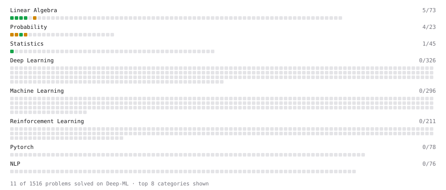

# Deep-ML

My machine learning practice from [Deep-ML](https://www.deep-ml.com). Every solution here was written by hand.

**9** solved · 9 problems · 0 labs · 0 math

[**Browse the interactive portfolio**](https://strjonas.github.io/deep-ml/) to replay this filling in over time.

## Problems

| | Difficulty | Solved | |
| --- | --- | --- | --- |
| [Calculate Mean by Row or Column](https://www.deep-ml.com/problems/4) | easy | 2026-10-03 | [solution](problems/0004-calculate-mean-by-row-or-column) |
| [Matrix-Vector Dot Product](https://www.deep-ml.com/problems/1) | easy | 2026-10-03 | [solution](problems/0001-matrix-vector-dot-product) |
| [Poisson Distribution Probability Calculator](https://www.deep-ml.com/problems/81) | easy | 2026-10-04 | [solution](problems/0081-poisson-distribution-probability-calculator) |
| [Reshape Matrix](https://www.deep-ml.com/problems/3) | easy | 2026-10-03 | [solution](problems/0003-reshape-matrix) |
| [Transpose of a Matrix](https://www.deep-ml.com/problems/2) | easy | 2026-10-03 | [solution](problems/0002-transpose-of-a-matrix) |
| [Binomial Distribution Probability](https://www.deep-ml.com/problems/79) | medium | 2026-10-04 | [solution](problems/0079-binomial-distribution-probability) |
| [Calculate Eigenvalues of a Matrix](https://www.deep-ml.com/problems/6) | medium | 2026-10-03 | [solution](problems/0006-calculate-eigenvalues-of-a-matrix) |
| [Normal Distribution PDF Calculator](https://www.deep-ml.com/problems/80) | medium | 2026-10-04 | [solution](problems/0080-normal-distribution-pdf-calculator) |
| [Simulate Markov Chain Transitions](https://www.deep-ml.com/problems/132) | medium | 2026-10-04 | [solution](problems/0132-simulate-markov-chain-transitions) |

---

_This file is regenerated by Deep-ML on every push._
